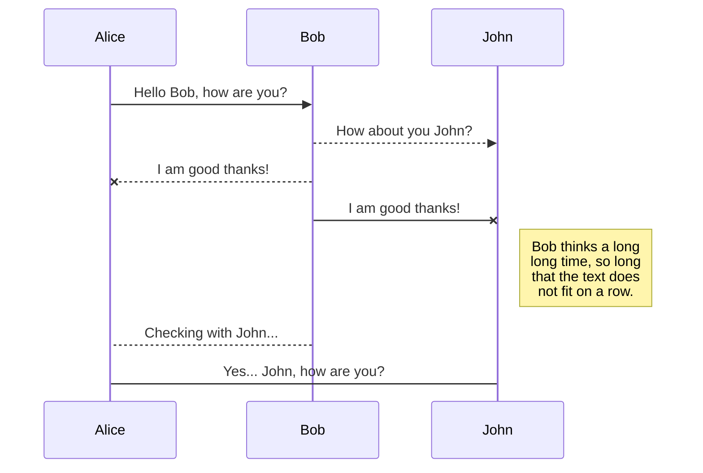
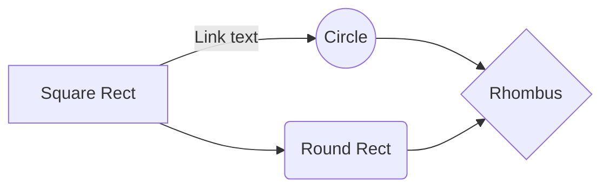

# Welcome To Smart Home Simulator
## This project is meant to be a Smart Home Simulator and was created for Concordia's SOEN 343 (Software Architecture and Design) Course. Link to the website
Link to the website

# Written by:
Written by:

1-Mansoureh Edalati(Mansiedi1980) 40037283
 2-Mathew 
 3-Pascal 
 4-Kev
## Objectives:

## Technology 
Stack Frontend: React 
Backend: Maven Java 
Database: MangoBD 
Testing:JUnit

## Organizational Block Diagram

You can rename the current file by clicking the file name in the navigation bar or by clicking the **Rename** button in the file explorer.

## Screenshots 
For a better experience, navigate to the hosted website directly.

## Useful Comments

## UML diagrams

You can render UML diagrams using [Mermaid](https://mermaidjs.github.io/). For example, this will produce a sequence diagram:

And this will produce a flow chart:

